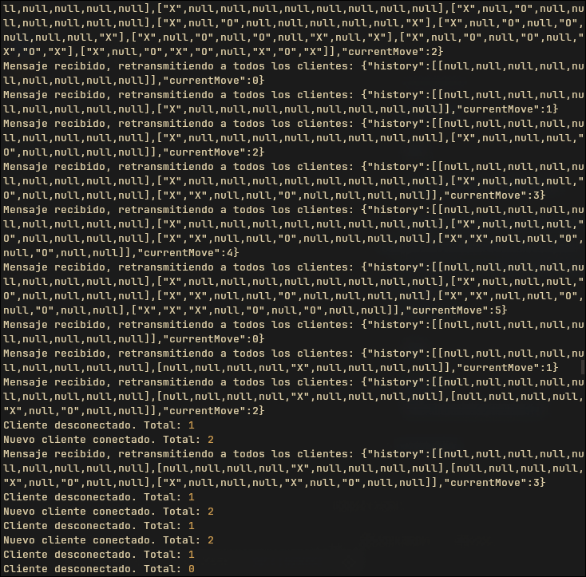

<div align="center">
    <h1 align="center">Tic-Tac-Toe Websocket</h1>
    <p align="center">
Un pequeño servidor WebSocket diseñado para habilitar el modo multijugador para el juego tic-tac-toe.
    </p>
</div>

</br>
</br>

## 🚀 Key Features

- Real-time Communication: Utilizes WebSockets for instant interaction between players.
- Game Room Management: Allows multiple pairs of players to have their own concurrent matches.
- State Synchronization: Keeps the game state updated for all participants within a room.

### 🛠️ Technologies Used

- Backend: Java WebSockets

</br>
</br>

## 📦 Installation and Execution

To run the server locally, follow these steps:

- Clone the repository:

```
git clone https://github.com/Andr3xDev/ARSW-TicTacBack.git
cd ARSW-TicTacBack
```

- Install dependencies & start the server:

```
mvn clean verify
mvn spring-boot:run
```

The server will be listening on ws://localhost:8080.

</br>
</br>

## 🎮 Integration with ARSW-tic-tac-toe

This backend is designed to connect with the ARSW-tic-tac-toe frontend. Ensure that the WebSocket server URL in your client points to the address where this backend is running.ste backend está diseñado para conectarse con el frontend de ARSW-tic-tac-toe. Asegúrate de que la URL del servidor WebSocket en tu cliente apunte a la dirección donde está corriendo este backend.


